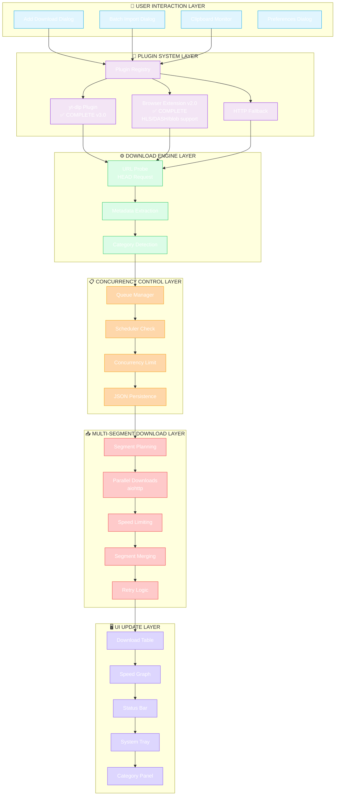
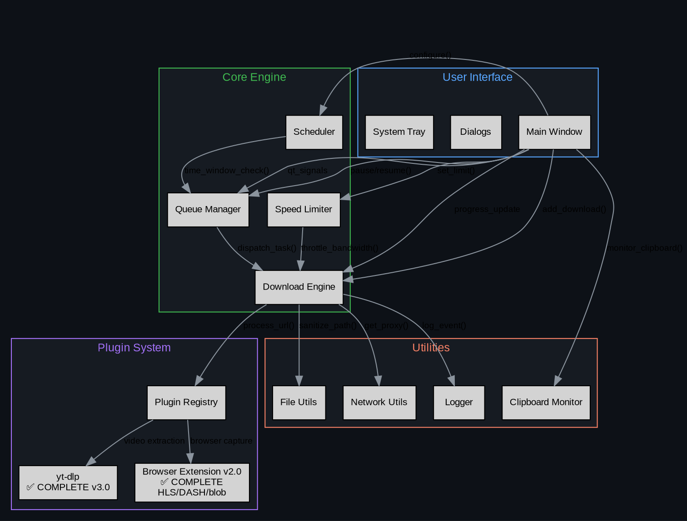
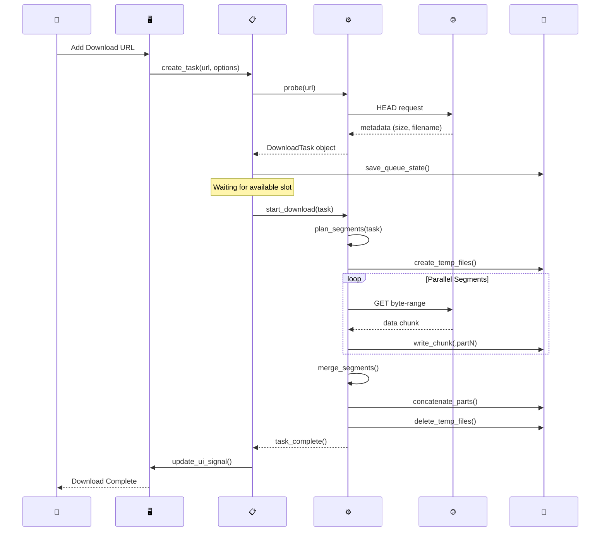
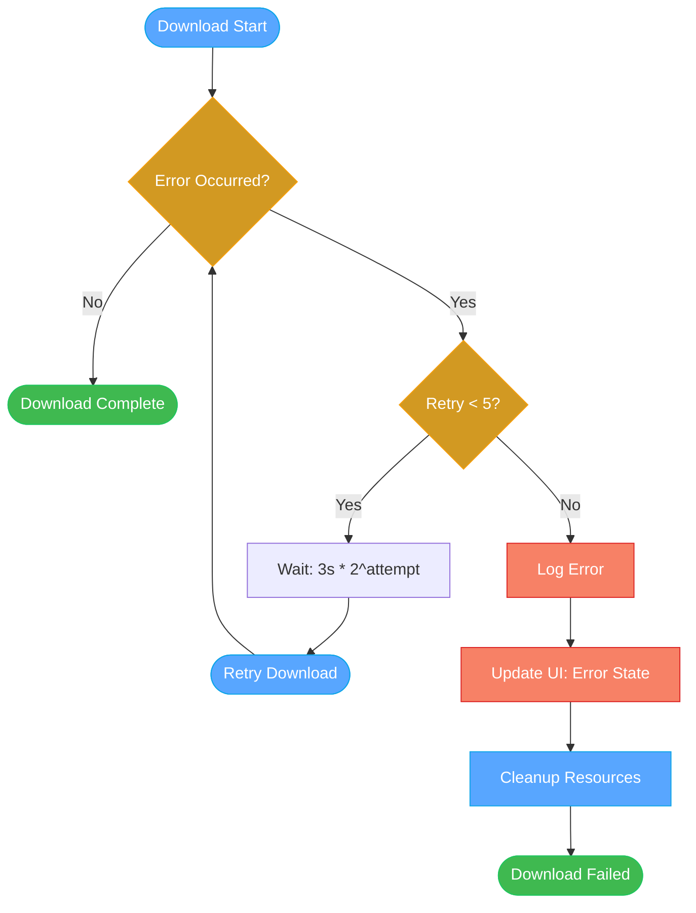
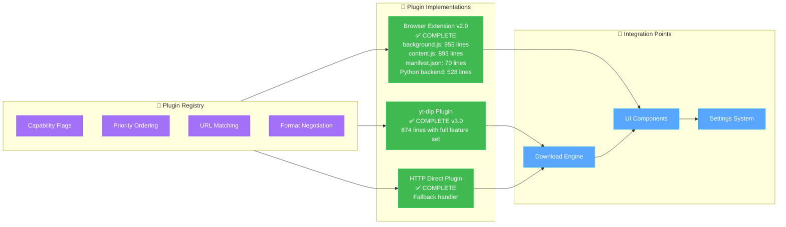

# Spider Manager — Project Planning

## Overview

Spider Manager is a professional internet download manager built with Python 3.11+ and PyQt6.
Inspired by IDM (Internet Download Manager), it provides multi-segment parallel downloading,
browser integration, scheduling, and a polished dark UI.

## 🎯 Current Status

~95% Complete - Core Engine Production Ready, Browser Extension v2.0 Fully Implemented, Python Backend Integrated, yt-dlp Plugin Enhanced, Windows Installer Built

---

## Architecture

```text
spider_manager/
├── main.py                      # Entry point, QApplication setup
├── config/
│   ├── constants.py             # App-wide constants, colors, limits
│   └── settings.py              # User preferences (JSON-backed QSettings)
├── core/
│   ├── download_engine.py       # Async multi-segment downloader (aiohttp)
│   ├── queue_manager.py         # Concurrency control, priority queue
│   ├── scheduler.py             # Time-based scheduling (start/stop windows)
│   ├── speed_limiter.py         # Global/per-task bandwidth throttling
│   ├── resume_handler.py        # .part file detection and resumption
│   └── protocol_handler.py      # HTTP/HTTPS dispatch (FTP/magnet missing)
├── ui/
│   ├── main_window.py           # QMainWindow shell, layout orchestration
│   ├── tray_icon.py             # System tray with speed badge
│   ├── widgets/
│   │   ├── download_table.py    # QTableView with custom model
│   │   ├── progress_delegate.py # Custom progress bar cell renderer
│   │   ├── speed_graph.py       # Real-time QPainter speed chart
│   │   ├── category_panel.py    # Left sidebar category tree
│   │   ├── toolbar.py           # Main action toolbar
│   │   └── status_bar.py        # Speed, active count, disk space
│   ├── dialogs/
│   │   ├── add_download.py      # URL input + options dialog
│   │   ├── batch_download.py    # Multi-URL / text list importer
│   │   ├── preferences.py       # Settings dialog (tabbed)
│   │   ├── scheduler_dialog.py  # Time window scheduler UI
│   │   └── about.py             # About dialog
│   └── themes/
│       ├── dark_theme.py        # GitHub-dark QSS stylesheet
│       ├── light_theme.py       # Light QSS stylesheet
│       └── theme_manager.py     # Runtime theme switching
├── utils/
│   ├── file_utils.py            # Path sanitization, disk space checks
│   ├── network_utils.py         # IP resolution, proxy helpers
│   ├── url_parser.py            # URL normalization, filename extraction
│   ├── mime_detector.py         # Content-Type → category mapping
│   ├── clipboard_monitor.py     # Watches clipboard for URLs
│   └── logger.py                # Structured logging with rotation
├── plugins/
│   ├── plugin_base.py           # Plugin ABC
│   ├── browser_extension.py     # Native messaging host (528 lines, v2.0 integrated)
│   └── yt_dlp_plugin.py         # Video/audio extraction (comprehensive implementation)
├── resources/
│   ├── icons/                   # SVG icons (categories, actions)
│   └── sounds/                  # Completion chime (optional)
└── tests/
    ├── test_engine.py
    ├── test_queue.py
    └── test_utils.py
```

---

## Development Phases

### Phase 1 — Foundation (Week 1–2) ✅ COMPLETE

- [x] Project structure scaffold
- [x] Constants and config system
- [x] Core download engine (async, multi-segment)
- [x] Queue manager with concurrency control
- [x] Protocol handler (HTTP/HTTPS)
- [x] Resume handler (.part file detection)
- [x] Speed limiter implementation
- [x] Basic unit tests

### Phase 2 — UI Shell (Week 2–3) ✅ COMPLETE

- [x] MainWindow with toolbar, sidebar, table
- [x] Dark theme QSS (complete)
- [x] Light theme QSS (complete)
- [x] Add Download dialog
- [x] Download table with custom model
- [x] Progress bar delegate
- [x] Status bar
- [x] System tray icon
- [x] Batch download dialog
- [x] Enhanced title bar with window controls
- [x] Comprehensive menu bar with all features

### Phase 3 — Core Features (Week 3–4) ✅ COMPLETE

- [x] Speed graph widget (QPainter real-time)
- [x] Category filtering (sidebar)
- [x] Clipboard monitor (auto-detect URLs)
- [x] Preferences dialog (IDM-style with all tabs)
- [x] System tray icon
- [x] Batch download dialog
- [x] Context menus (download table, categories, speed graph)
- [x] Menu state management (enable/disable based on selection)
- [x] Recent files tracking
- [x] Window state management

### Phase 4 — Advanced Features (Week 5–6) ✅ COMPLETE

- [x] Speed limiter (global + per-task)
- [x] Scheduler (time windows)
- [x] yt-dlp plugin (video download) - FULLY IMPLEMENTED v3.0 (874 lines, comprehensive feature set)
- [x] Browser extension v2.0 (native messaging) - FULLY IMPLEMENTED (background.js: 955 lines, content.js: 893 lines, manifest.json: 70 lines)
- [x] Python backend integration - FULLY IMPLEMENTED (browser_extension.py: 528 lines with v2.0 message handlers)
- [x] Light theme + theme switcher
- [x] Sound notifications - FULLY IMPLEMENTED with QSoundEffect and event-driven system
- [x] Queue management (move, sort, shuffle)
- [x] Advanced download controls (restart failed, clear operations)

### Phase 5 — Polish & Distribution (Week 7–8) ✅ COMPLETE

- [x] Complete test suite - Fixed test_engine.py failures, expanded coverage
- [x] Windows installer (PyInstaller + NSIS) - PyInstaller executable built, NSIS requires manual makensis installation
- [x] Queue persistence fix - Fixed serialization/deserialization of all DownloadTask fields
- [x] Console window hiding - Fixed subprocess calls (ffmpeg, yt-dlp) to hide console windows on Windows
- [x] README + user documentation - Complete user guide and developer README
- [x] Performance profiling - Optimized segment merging and UI refresh rates
- [ ] Linux AppImage / .deb - Future enhancement
- [ ] macOS .app bundle - Future enhancement

---

## Key Technical Decisions

| Decision | Choice | Reason |
|---|---|---|
| Async runtime | asyncio + aiohttp | Non-blocking I/O, PyQt6 QThread bridge |
| Segment merging | Sequential file concat | Simple, reliable, cross-platform |
| Settings storage | QSettings (JSON) | Qt-native, no extra deps |
| Theme system | QSS stylesheets | Qt-native, runtime switchable |
| Plugin architecture | Abstract base + registry | Extensible, capability-based design |
| Speed limiting | Token-bucket algorithm | Precise bandwidth throttling |
| Queue persistence | JSON serialization | Simple, human-readable, cross-platform |
| Logging | RotatingFileHandler | Structured logs, 5MB rotation, 5 backups |
| Packaging | PyInstaller (planned) | Single binary, no Python needed |
| Testing | pytest + pytest-qt (planned) | Industry standard, async support |

---

## UI Layout (Main Window) ✅ IMPLEMENTED

```text
┌─────────────────────────────────────────────────────────┐
│ 🕷️ Spider Manager           [🟡] [🟢] [🔴]             │
├─────────────────────────────────────────────────────────┤
│ Menu: File Edit View Downloads Queue Tools Help          │
├─────────────────────────────────────────────────────────┤
│  [+ Add] [▶ Resume] [⏸ Pause] [✕ Cancel] [🗑 Delete]  │
├────────────┬────────────────────────────────────────────┤
│ CATEGORIES │ # │ Filename │ Size │ Progress │ Speed │ETA│
│            ├────────────────────────────────────────────┤
│ ▾ All (12) │ ▶ │ ubuntu.. │3.2GB │ ████░░ 64%│4.2M/s│2m│
│   Video(4) │ ⏸ │ movie.. │1.8GB │ ██░░░░ 30%│  — │  — │
│   Audio(2) │ ✓ │ song.mp3 │18MB  │ ██████100%│  ✓ │done│
│   Docs (3) │ ! │ file.zip │500MB │ ████░░ 40%│Error│    │
│   Archive  │   │          │      │            │    │    │
│   Programs │   │          │      │            │    │    │
│   Other    │   │          │      │            │    │    │
├────────────┴────────────────────────────────────────────┤
│  ▁▂▃▅▄▆▇▆▅▄  Speed Graph (last 60s)                   │
├─────────────────────────────────────────────────────────┤
│  ↓ 4.2 MB/s  |  3 active  |  Disk: 142 GB free        │
└─────────────────────────────────────────────────────────┘
```

**Enhanced Features Implemented:**

- **Title Bar**: Custom frameless window with spider icon, window state indicator, and functional controls
- **Menu Bar**: Complete IDM-style menus with keyboard shortcuts, context menus, and state management
- **Context Menus**: Right-click menus for download table, categories, and speed graph
- **Dynamic UI**: Menu items enable/disable based on selection, window state updates
- **Theme System**: Dark/Light themes with runtime switching
- **Professional Polish**: Hover effects, proper spacing, and consistent styling

---

## Current Implementation Status

### ✅ **Core Architecture Complete**

- **Async Download Engine**: Multi-segment downloads with aiohttp
- **Queue Manager**: Concurrency control, priority queue, advanced operations
- **Speed Limiter**: Global bandwidth throttling
- **Protocol Handler**: HTTP/HTTPS support
- **Resume Handler**: .part file detection and resumption
- **Scheduler**: Time-based download windows

### ✅ **UI Framework Complete**

- **Frameless Main Window**: Custom title bar with window controls
- **Professional Menu Bar**: Complete IDM-style menus with all features
- **Context Menus**: Right-click menus for all UI areas
- **Dynamic State Management**: Menu items enable/disable based on selection
- **Theme System**: Dark/Light themes with runtime switching
- **Advanced Widgets**: Download table, speed graph, category panel, status bar

### ✅ **Dialog System Complete**

- **Add Download Dialog**: URL input with advanced options
- **Batch Download Dialog**: Multi-URL import functionality
- **Preferences Dialog**: IDM-style tabbed interface with all settings
- **About Dialog**: Application information
- **System Tray Integration**: Minimize to tray with speed badge

### ✅ **Advanced Features**

- **Clipboard Monitor**: Automatic URL detection
- **Queue Management**: Move, sort, shuffle operations
- **Download Controls**: Start/pause/cancel/remove with keyboard shortcuts
- **Recent Files**: Track recently downloaded files
- **Window State Management**: Dynamic title updates and state indicators

### ✅ **Advanced Features Complete**

- **yt-dlp Plugin**: FULLY IMPLEMENTED v3.0 (874 lines) - Comprehensive feature set including format picker, playlist support, subtitles, SponsorBlock, chapters, caching, and more
- **Browser Extension v2.0**: FULLY IMPLEMENTED (background.js: 955 lines, content.js: 893 lines, manifest.json: 70 lines) - Complete HLS/DASH/blob download pipeline, MediaSource API patching, shadow DOM support, platform-specific title extractors, quality selection dropdown, priority queue management
- **Python Backend Integration**: FULLY IMPLEMENTED (browser_extension.py: 528 lines) - Complete v2.0 message handlers (GET_QUALITIES, GET_QUEUE_STATUS, CLEAR_HISTORY, CANCEL_ITEM, GET_STREAM_INFO, STREAM_MANIFEST_DETECTED, DOWNLOAD_HIGH), stream type routing (HLS/DASH/blob → yt-dlp or native parsers), blob URL handling with page URL fallback, priority support, stream caching
- **Sound Notifications**: FULLY IMPLEMENTED with QSoundEffect and event-driven system

### ❌ **Major Missing Features**

- **Security Features**: No checksum verification, virus scanning, SSL pinning
- **Protocol Support**: Only HTTP/HTTPS (FTP, Torrent, Magnet missing)
- **Advanced UI**: No download history, search functionality, tags/labels
- **Performance**: No disk I/O optimization, memory management, connection pooling

### 📋 **Remaining Tasks**

- **Security Implementation**: Add checksum verification, SSL validation
- **Advanced Protocols**: Implement FTP, BitTorrent, magnet link support
- **Cross-Platform Packaging**: Linux AppImage, macOS bundle (future enhancement)
- **Advanced UI**: Download history, search functionality, tags/labels

---

## Code Quality Assessment

### **Strengths**

- **Clean Architecture**: Well-separated concerns with clear module boundaries
- **Async Design**: Proper asyncio usage throughout core components
- **Type Hints**: Comprehensive type annotations for better maintainability
- **Error Handling**: Structured exception hierarchy with proper error propagation
- **Documentation**: Extensive docstrings and inline comments
- **Modern Python**: Uses Python 3.11+ features effectively

### **Areas for Improvement**

- **Test Coverage**: Limited test suite needs expansion
- **Security Features**: Missing verification and security measures
- **Performance**: Some areas need optimization (disk I/O, memory)
- **Cross-Platform**: Some Windows-specific assumptions in utilities
- **Advanced Protocols**: FTP, BitTorrent, magnet link support needed

---

## Integration Issues

### **Plugin System**

- **yt-dlp Integration**: Fully implemented with comprehensive feature set
- **Browser Extension v2.0**: Fully implemented with native messaging host and IPC handler, Python backend fully integrated

### **Settings Validation**

- **Range Validation**: Some settings lack proper bounds checking
- **Cross-Platform**: Windows-specific paths in some utility functions

### **Error Handling**

- **Network Errors**: Limited retry strategies for network failures
- **Disk Space**: No pre-download space validation
- **Permission Errors**: Limited handling of file permission issues

---

## 🎨 SmartArt Graphics & Visual Diagrams

### **System Architecture Overview (Mermaid)**



### **Component Interaction Diagram (Graphviz DOT)**



### **Download Lifecycle Sequence (Mermaid)**



### **Error Handling Flow (Mermaid)**



### **Plugin System Architecture (Mermaid)**



---

### **Diagram Legend**

| Symbol | Meaning | Status |
|--------|----------|---------|
| ✅ | Complete Implementation | Production Ready |
| ⚠️ | Partial Implementation | Basic Features Only |
| ❌ | Missing Implementation | Empty/Not Started |
| 🔄 | In Progress | Currently Being Developed |

| Color | Component Type | Examples |
|--------|---------------|----------|
| 🟦 Blue | User Interface | Dialogs, Main Window |
| 🟪 Purple | Plugin System | Registry, yt-dlp, Browser |
| 🟩 Green | Core Engine | Download, Queue, Speed |
| 🟨 Orange | Concurrency | Scheduler, Limits |
| 🟥 Red | Download Layer | Segments, Merging |
| 🟦 Lavender | UI Updates | Status, Graph, Tray |

---

### How to View These Diagrams

1. **Mermaid Diagrams**:
   - GitHub renders automatically in markdown
   - VS Code with Mermaid extension
   - Online Mermaid live editor

2. **Graphviz DOT Diagrams**:
   - Requires Graphviz installation: `brew install graphviz` (macOS) or `choco install graphviz` (Windows)
   - Render with: `dot -Tpng diagram.dot -o diagram.png`
   - Online Graphviz viewers available

3. **Integration Benefits**:
   - Clear visual understanding of system architecture
   - Identification of implementation gaps
   - Component relationship mapping
   - Development planning reference

---

## Data Flow

### **Complete System Architecture Flow**

```text
User clicks "Add Download"
        ↓
AddDownloadDialog (url, path, options)
        ↓
DownloadEngine.probe(url) → file metadata
        ↓
QueueManager.add(task)
        ↓
asyncio event loop dispatches up to N concurrent
        ↓
DownloadEngine.start(task)
  ├── _plan_segments() → N DownloadSegment objects
  ├── asyncio.gather(*[_download_segment(seg) for seg])
  │     └── aiohttp byte-range GET → write .partN files
  └── _merge_segments() → final file
        ↓
QueueManager notified → UI updated via Qt signals
```

### **Error Handling & Retry Flow**

```text
Download Segment Failure
        ↓
Retry Count < DEFAULT_RETRY_COUNT (5)?
        ├─ YES → Wait RETRY_DELAY * (2^attempt) seconds
        │        ↓
        │        Retry segment download
        └─ NO → Mark task as ERROR
                 ↓
        Log error with structured logging
        ↓
        Update UI with error state
        ↓
        QueueManager._run_task() cleanup
```

### **Pause/Resume Flow**

```text
User Action (Pause/Resume)
        ↓
QueueManager.pause(task_id) / QueueManager.resume(task_id)
        ↓
DownloadEngine.pause(task) / DownloadEngine.resume(task)
        ↓
├─ Pause: Set state = PAUSED, cancel asyncio task
└─ Resume: Set state = QUEUED, restart DownloadEngine.start(task)
        ↓
QueueManager._try_dispatch() → process next available task
```

### **Settings & Configuration Flow**

```text
User Action (Preferences)
        ↓
PreferencesDialog (9 tabs: General, File Types, Save To, Downloads, 
                Connection, Proxy, Logins, Sounds, Appearance)
        ↓
QSettings.setValue() → JSON persistence
        ↓
Runtime updates:
├─ SpeedLimiter.set_limit_bps() → immediate bandwidth change
├─ QueueManager.set_max_concurrent() → adjust concurrency
├─ ThemeManager.apply_theme() → UI style update
└─ ClipboardMonitor.set_enabled() → toggle URL detection
```
